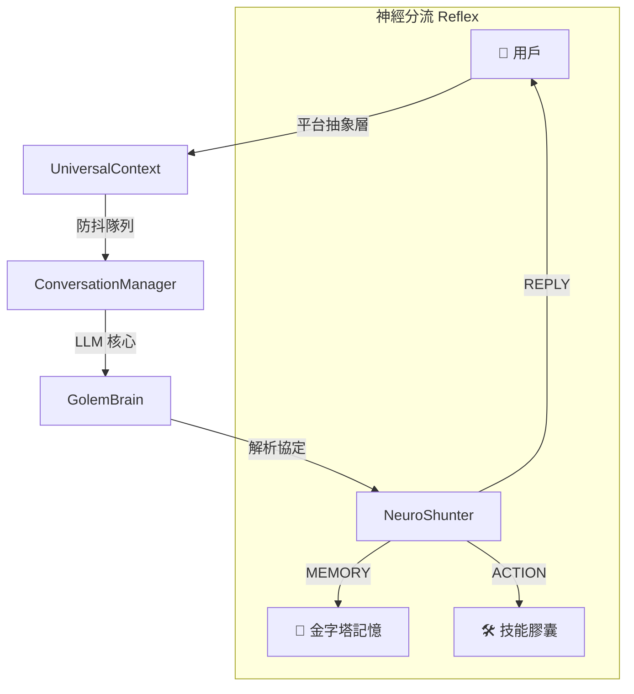

<div align="center">
  
  <h1>🤖 Project Golem v9.1</h1>
  <p><b>Ultimate Chronos + MultiAgent + Social Node Edition</b></p>

  <p>
    
    
    
    
    
  </p>

  <p>
    <a href="#-這是什麼">這是什麼？</a> •
    <a href="#-核心亮點">功能展示</a> •
    <a href="#-系統架構">系統架構</a> •
    <a href="#-使用案例與介面展示">實戰截圖</a> •
    <a href="#-快速開始">快速開始</a>
  </p>

  **繁體中文** | [English](docs/README.en.md) | [貢獻指南](docs/CONTRIBUTING.zh-TW.md)
</div>

---

## 📖 目錄 (Table of Contents)
- [✨ 這是什麼？](#-這是什麼)
- [🌟 核心亮點](#-核心亮點)
- [📸 使用案例與介面展示](#-使用案例與介面展示)
- [⚡ 快速開始](#-快速開始)
- [🎮 指令速查](#-指令速查-command-reference)
- [🏗️ 系統架構](#-系統架構)
- [🗂️ 產品級目錄分層](#-產品級目錄分層)
- [🧠 金字塔式長期記憶](#-金字塔式長期記憶-pyramidal-long-term-memory)
- [📖 完整文件與指南](#-完整文件與指南)

---

## ✨ 這是什麼？

**Project Golem** 不是一個普通的聊天機器人。它是一個可選擇 **Web Gemini（Browser-in-the-Loop）** 或 **Ollama（本地/私有部署）** 作為大腦的自主 AI 代理系統。

- 🧠 **記住你** — 金字塔式 5 層記憶壓縮，理論上可保存 **50 年**的對話精華。
- 🤖 **自主行動** — 當你不在時，它會主動瀏覽新聞、自省思考、發送消息給你。
- 🎭 **召喚 AI 團隊** — 一個指令生成多個 AI 專家進行圓桌討論，產出共識摘要。
- 🔧 **動態擴充** — 支援熱載入技能模組 (Skills)，甚至能讓 AI 在沙盒中寫扣自學新技能。

> **雙後端架構**：預設可使用 Browser-in-the-Loop 直接操控 Web Gemini；也可切換到 Ollama API 走本地模型與私有部署路線。

---

## 🌟 核心亮點

<table width="100%">
  <tr>
    <td width="50%" valign="top">
      <h3>🧠 金字塔式長期記憶</h3>
      <p>透過 5 層壓縮機制，確保 Golem 的記憶永不丟失且極度輕量。從每小時日誌到紀元里程碑，50 年記憶僅佔 <b>3MB</b>。</p>
    </td>
    <td width="50%" valign="top">
      <h3>🎭 互動式多智能體</h3>
      <p>一鍵召喚專家團隊進行圓桌討論。多智能體之間會針對問題進行辯論、激盪，最後給出高濃度的共識總結。</p>
    </td>
  </tr>
  <tr>
    <td width="50%" valign="top">
      <h3>🤖 自主行動與觀察</h3>
      <p>當你不在時，它會主動瀏覽新聞、自省思考、發送消息給你。它具備真正的「自由意志」與排程能力。</p>
    </td>
    <td width="50%" valign="top">
      <h3>🔧 動態技能擴充</h3>
      <p>支援熱載入技能模組 (Skills)，甚至能讓 AI 在沙盒中寫扣自學新技能，實現功能的無限擴張。</p>
    </td>
  </tr>
</table>

---

## 📸 使用案例與介面展示

為了幫助您更好地監控與管理您的 Golem，我們提供了功能完善的 **Web Dashboard**。

### 🎛️ 戰術控制台 (Dashboard Home)
*總覽您的高階 AI 代理人狀態、活躍進程與動態行為決策。*


### 💻 即時終端機對話 (Web Terminal)
*除了 Telegram / Discord 外，您也可以直接在網頁端與 Golem 進行無延遲的交談，並即時追蹤任務狀態。*


### 📚 動態技能管理 (Skill Manager)
*如同插拔隨身碟般，隨時為您的 Golem 安裝、開啟或關閉各種特殊職能與無縫 API 對接。*


### 👥 人格設定 (Personality Settings)
*設定 Golem 的基本屬性與行為模式。*


### 🧠 記憶核心 (Memory Core)
*查看 Golem 的記憶核心。*


### ⚙️ 系統設定 (Settings)
*直觀管理安全權限、API Keys 與深度系統整合，免去手動修改設定檔的麻煩。*


---

## ⚡ 快速開始

### 環境需求
- **Node.js** v20+
- **Chromium / Google Chrome** (供 Playwright 自動化操控使用)
- **Telegram/Discord Bot Token** (非必填，若只需本機操作可免)

### ⚡ 最推薦：一鍵安裝與啟動模式 (Magic Mode)
我們為初次使用者準備了無腦全自動裝機腳本。
雙擊專案目錄下的 `Start-Golem.command` (Mac/Linux)，即會自動下載依賴並啟動 Node 伺服器與 Dashboard。

**🔨 CLI 手動模式 (Terminal)**
```bash
# 賦予執行權限
chmod +x setup.sh

# 一鍵自動安裝依賴與解決 Port 衝突
./setup.sh --magic

# 直接啟動
./setup.sh --start
```

**🖥️ VPS / 無桌面環境（Headless + noVNC）**
```bash
# Docker 一鍵安裝部署（含 noVNC）
./setup.sh --deploy-docker

# Linux 本機一鍵安裝部署（含 noVNC）
./setup.sh --deploy-linux

# 停止 headless 服務
./setup.sh --headless-stop
```

**🔐 建議設定（純 Playwright + 安全）**
```env
GOLEM_MEMORY_MODE=lancedb-pro
GOLEM_BACKEND=gemini
GOLEM_EMBEDDING_PROVIDER=local
PLAYWRIGHT_STEALTH_ENABLED=true
ALLOW_REMOTE_ACCESS=false
# 若需要遠端管理，務必設定：
# REMOTE_ACCESS_PASSWORD=your-strong-password
# SYSTEM_OP_TOKEN=your-operation-token
```

**🦙 Ollama 私有化範例**
```env
GOLEM_BACKEND=ollama
GOLEM_OLLAMA_BASE_URL=http://127.0.0.1:11434
GOLEM_OLLAMA_BRAIN_MODEL=llama3.1:8b
GOLEM_EMBEDDING_PROVIDER=ollama
GOLEM_OLLAMA_EMBEDDING_MODEL=nomic-embed-text
# 選填：GOLEM_OLLAMA_RERANK_MODEL=bge-reranker-v2-m3
```

**🏗️ 架構治理檢查**
```bash
npm run arch:check
```


### Windows
> **建議：** 為了獲得最佳的 Linux 環境模擬體驗，強烈建議 Windows 用戶使用 **[Git Bash](https://git-scm.com/downloads)** 來執行腳本。

1. 打開 Git Bash。
2. 切換至專案目錄。
3. 執行 `./setup.sh --magic` 進行自動化安裝與啟動。

---

## 🎮 指令速查 (Command Reference)

| 指令 | 功能 |
|------|------|
| `/help` | 查看完整指令說明 |
| `/new` | 重置對話並載入相關記憶 |
| `/learn <功能>` | 讓 AI 自動學習並生成新技能 |
| `/skills` | 列出所有已安裝的技能 |

---

## 🏗️ 系統架構

Golem 採用 **Browser-in-the-Loop** 混合架構，賦予其超越標準 API 限制的靈活性。



### 🧠 技術深潛
- **Browser-in-the-Loop**: 與傳統基於 API 的機器人不同，Golem 使用 **Playwright** 在 Web Gemini 上模擬人類行為。這提供了免費訪問 **1M+ Token 無限上下文視窗** 的能力。
- **Ollama Local Backend**: 可切換為本地/私有部署模型，支援 `brain + embedding`，並可選填 `rerank` 模型做記憶召回重排。
- **Reflex Shunting**: Golem 的大腦產出結構化的 `GOLEM_PROTOCOL` 指令而非純文字。這讓代理人能精準決定何時該說話、何時該記憶、以及何時該執行技能腳本。

## 🗂️ 產品級目錄分層

為了支援多人協作與長期演進，專案已改為「產品級分層」：

```text
project-golem/
├── apps/
│   ├── runtime/       # 核心啟動入口（實際執行）
│   └── dashboard/     # Dashboard 插件層
├── src/               # 核心領域邏輯（Brain / Memory / Skills / Managers）
├── web-dashboard/     # Web UI 與 API 路由
├── packages/          # 共用套件（已落地 security/memory/protocol facade）
├── infra/             # 預留：部署、監控、環境治理
├── index.js           # 相容入口（shim，轉發到 apps/runtime）
└── dashboard.js       # 相容入口（shim，轉發到 apps/dashboard）
```

> 此次重構採「相容優先」策略：既有指令與腳本可持續使用，同時逐步遷移到大型產品結構。

---

## 🧠 金字塔式長期記憶 (Pyramidal Long-term Memory)

這是 Golem 最獨特的技術能力，透過多層級壓縮確保記憶永不丟失：

1. **第 0 層 (Tier 0)**: 每小時原始對話日誌。
2. **第 1 層 (Daily)**: 每日摘要（約 1,500 字）。
3. **第 2 層 (Monthly)**: 每月亮點。
4. **第 3 層 (Yearly)**: 年度回顧。
5. **第 4 層 (Epoch)**: 紀元里程碑。

**50 年存儲對比：**
* **傳統模式 (無壓縮)**: ~18,250 檔案 / 500 MB+
* **Golem 金字塔**: **~277 檔案 / 3 MB**

### 📓 日記 Rotate（7 天保留 + 週/月/年摘要）

Dashboard 的「繼絆日記」已支援自動分層整理：

1. **原始日記（Tier 0）**：至少保留最近 7 天完整內容。
2. **週摘要（Tier 1）**：超過 7 天後自動彙整為週摘要，並清理對應原文。
3. **月摘要（Tier 2）**：由週摘要再壓縮成月摘要。
4. **年摘要（Tier 3）**：由月摘要再壓縮成年摘要。

日記資料已採用 **SQLite (WAL)** 儲存（每個 Golem 一個 DB），首次啟動會自動從舊版 `diary-book.json` 遷移。

可透過 `.env` 調整策略：

```env
DIARY_RAW_RETENTION_DAYS=7
DIARY_WEEKLY_RETENTION_DAYS=365
DIARY_MONTHLY_RETENTION_DAYS=1825
DIARY_ROTATE_MIN_INTERVAL_MS=300000
DIARY_BACKUP_MAX_FILES=120
DIARY_BACKUP_RETENTION_DAYS=180
```

也可透過 API 手動觸發：
- `POST /api/diary/rotate`
- `GET /api/diary/rotation/history`
- `GET /api/diary/backup/download?file=...`
- `POST /api/diary/backup`
- `POST /api/diary/backup/cleanup`
- `GET /api/diary/restore/preview?file=...`
- `POST /api/diary/restore`

---

---

## 📖 完整文件與指南

為了保持本頁面的簡潔，更深入的技術細節已移至專屬文檔：

| 文件 | 說明 |
|------|------|
| [🤖 編碼代理指南](docs/AGENTS.md) | **[重要]** 供 AI 助理或開發者參考的程式碼維護與架構規範 |
| [🗂️ 大型產品架構藍圖](docs/大型產品架構藍圖.md) | `apps + packages + infra` 分層策略與遷移路線圖 |
| [🏗️ 架構治理規範](infra/architecture/README.md) | 分層邊界規則與 `arch:check` 自動檢查 |
| [🔌 MCP 使用與開發指南](docs/MCP-使用與開發指南.md) | **[最新]** 如何安裝、配置與調用 MCP Server (含 Hacker News 範例) |
| [🧠 記憶系統架構說明](docs/記憶系統架構說明.md) | 金字塔壓縮原理與存放路徑解析 |
| [🖥️ VPS Headless + VNC 指南](docs/VPS_VNC_Setup_Guide.md) | 無桌面 Linux / Docker 的 noVNC 一鍵部署 |
| [🖥️ Web Dashboard 使用說明](docs/Web-Dashboard-使用說明.md) | Web UI 各個分頁的延伸細節 |
| [🛠️ 開發者實作指南](docs/開發者實作指南.md) | 如何實作新的 Skill 與 Golem Protocol 格式規範 |
| [🎮 完整指令說明一覽表](docs/golem指令說明一覽表.md) | Telegram / Discord 指令速查 |
| [🔑 取得機器人 Token 教學](docs/如何獲取TG或DC的Token及開啟權限.md) | 如何設定你的外部通訊平台 |

---

## ☕ 支援專案與社群

如果 Golem 對你有幫助，歡迎賞顆星星 ⭐️，或請作者喝杯咖啡！

<a href="https://www.buymeacoffee.com/arvincreator" target="_blank">
  
</a>

[💬 加入 Line 社群：Project Golem AI 系統代理群](https://line.me/ti/g2/wqhJdXFKfarYxBTv34waWRpY_EXSfuYTbWc4OA?utm_source=invitation&utm_medium=link_copy&utm_campaign=default)  
[👾 加入 Discord 社群：Project Golem 官方頻道](https://discord.gg/bC6jtFQra)

---

## ⚠️ 免責聲明

1. **安全風險**：請絕對避免在生產環境中以 root/admin 身份運行。
2. **隱私提醒**：根目錄的 `golem_memory/` 資料夾中包含您的 Google 登入 Cookie 會話，請務必妥善保管勿外洩。
3. *使用者需自行承擔本自動化腳本操作所產生的任何風險，開發者不提供任何擔保或法律責任。*

---

<div align="center">

**Developed with ❤️ by Arvincreator & @sz9751210**

</div>
