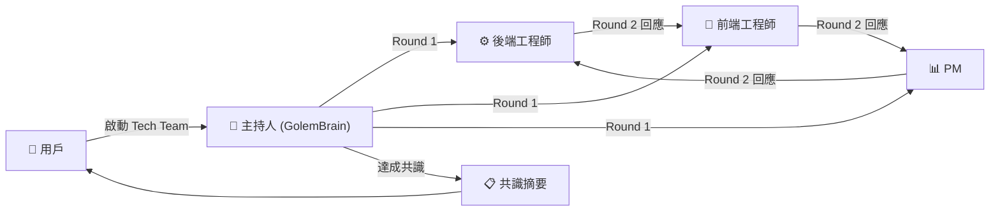

<div align="center">

# 🤖 Project Golem v9.0


### 具備長期記憶、自由意志與跨平台能力的自主 AI 代理系統

<p>
  
  
  
  
  
</p>

[功能一覽](#-核心能力) · [系統架構](#-系統架構) · [記憶系統](#-金字塔式長期記憶) · [快速開始](#-快速開始) · [使用指南](#-使用指南) · [文件](#-完整文件)

<br/>

**繁體中文** | [English](docs/README_EN.md)

</div>

---

## ✨ 這是什麼？

**Project Golem** 不是一個普通的聊天機器人。

它是一個以 **Web Gemini 的無限上下文**為大腦、以 **Puppeteer** 為雙手的自主 AI 代理人，能夠：

- 🧠 **記住你** — 金字塔式 5 層記憶壓縮，理論上可保存 **50 年**的對話精華
- 🤖 **自主行動** — 當你不在時，它會主動瀏覽新聞、自省思考、傳送消息給你
- 🎭 **召喚 AI 團隊** — 一個指令生成多個 AI 專家進行圓桌討論，產出共識摘要
- 🔧 **自我修復** — DOM Doctor 讓它在 Google 更新 UI 後自動癒合，無需人工介入
- 📚 **自學新技能** — `/learn` 指令讓 Golem 用算力為自己撰寫新的技能模組

> **Browser-in-the-Loop 架構**：Golem 不依賴官方 API，而是直接操控瀏覽器使用 Web Gemini，享有「無限上下文視窗」的優勢。

---

## 🚀 核心能力

<table>
<tr>
<td width="50%">

### 🧠 長期記憶金字塔
每小時日誌 → 每日摘要 → 月度精華 → 年度回顧 → 紀元里程碑，50 年後整個記憶庫只有 **~3 MB**。

### 🎭 互動式多智能體
一鍵召喚 AI 技術團隊、辯論小組或創意工作坊，多個 AI 角色互相對話、辯論、達成共識。

### ⏰ 時序領主 (Chronos)
自然語言設定排程：「明天早上 9 點提醒我」、「每週五幫我整理本週摘要」。

</td>
<td width="50%">

### 🛡️ 自我防護
Security Manager 攔截高危指令，DOM Doctor 自動修復 Selector，KeyChain 智慧金鑰輪替。

### 🔧 技能膠囊系統
技能可打包成 Base64 字串跨實例分享，`/learn` 指令讓 AI 自動生成新技能並熱載入。

### 🌐 Multi-Golem 多實體
一台主機運行多個獨立 Golem，每個有獨立大腦、獨立記憶、獨立對話隊列，並可透過內部事件匯流排互相通訊。

</td>
</tr>
</table>

---

## 🏗️ 系統架構

Golem 採用 **Browser-in-the-Loop** 混合架構：

```
Telegram / Discord
       │
       ▼
 UniversalContext     ← 平台抽象層（統一 TG/DC 差異）
       │
       ▼
ConversationManager   ← 防抖隊列（1.5s 合併連發訊息）
       │
       ▼
   GolemBrain         ← Puppeteer 操控 Web Gemini
  (sendMessage)
       │
       ▼
  NeuroShunter        ← 回應分流中樞（解析 Golem Protocol）
       │
  ┌────┼──────────────┐
  ▼    ▼              ▼
REPLY  MEMORY      ACTION
回覆   長期記憶    技能/指令/
用戶   寫入         多代理
```

### 核心元件

| 元件 | 說明 |
|------|------|
| `GolemBrain` | 封裝 Puppeteer，提供 `sendMessage` / `recall` / `memorize` API |
| `UniversalContext` | 平台抽象層，讓業務邏輯不感知 Telegram 或 Discord |
| `ConversationManager` | 防抖隊列 + 觀察者/靜默模式控制 |
| `NeuroShunter` | 解析 AI 結構化回應，路由到記憶/回覆/技能執行 |
| `AutonomyManager` | 自由意志引擎：自發聊天、新聞播報、自省 |
| `ChatLogManager` | 金字塔式 5 層記憶壓縮引擎 |

---

## 🧠 金字塔式長期記憶

這是 Golem 最獨特的技術能力之一。

```
Tier 0  每小時原始日誌  →  72 小時後自動壓縮
   ↓ (Gemini 壓縮 ~1500 字)
Tier 1  每日摘要        →  90 天後自動壓縮
   ↓ (Gemini 壓縮 ~3000 字)
Tier 2  月度精華        →  5 年後自動壓縮
   ↓ (Gemini 壓縮 ~5000 字)
Tier 3  年度回顧        →  永久保留
   ↓ (Gemini 壓縮 ~8000 字)
Tier 4  紀元里程碑      →  永久保留
```

**50 年規模比較：**

| 方案 | 檔案數量 | 儲存量 |
|------|---------|--------|
| 舊版（無壓縮） | ~18,250 個 | ~500 MB+ |
| **Golem 金字塔** | **~277 個** | **~3 MB** |

啟動時依序注入：`紀元摘要 → 年度回顧 → 月度精華 → 每日摘要`，Context 預算固定 ~50K tokens，不隨時間膨脹。

---

## 🎭 互動式多智能體



用戶可在任何輪次透過 `@AgentName` 點名特定成員回應，或全體廣播。早期共識偵測可提前結束討論。

---

## ⚡ 快速開始

### 環境需求

- **Node.js** v20+
- **Google Chrome**（Puppeteer 需要）
- **Telegram Bot Token**（從 [@BotFather](https://t.me/BotFather) 取得）

### 安裝

```bash
# 1. Clone 專案
git clone https://github.com/Arvincreator/project-golem.git
cd project-golem

# 2. 一鍵安裝（Mac / Linux）
chmod +x setup.sh && ./setup.sh --install

# 3. 配置環境變數
./setup.sh --config

# 4. 啟動
./setup.sh --start
```

**Windows 用戶**：雙擊 `setup.bat` 進入自動化安裝流程。

### 手動 `.env` 設定

```env
# 必填
TELEGRAM_TOKEN=你的_Bot_Token
ADMIN_ID=你的_Telegram_User_ID

# 選填
DISCORD_TOKEN=你的_Discord_Token
GOLEM_MODE=SINGLE                 # 或留空（使用 golems.json 多機模式）
GOLEM_MEMORY_MODE=browser         # browser / qmd / native
GEMINI_API_KEYS=key1,key2         # 多組 Key 逗號分隔
```

---

## 🎮 使用指南

### 系統指令

| 指令 | 功能 |
|------|------|
| `/help` | 查看完整指令說明 |
| `/new` | 重置對話視窗並重新載入記憶 |
| `/learn 意圖描述` | 讓 AI 自動生成新技能 |
| `/skills` | 列出所有已安裝技能 |
| `/callme 暱稱` | 設定你的稱呼 |

### 自然語言操作（直接說就好）

```
「明天早上 9 點提醒我開會」
「召喚技術團隊討論這個架構問題」
「搜尋今天的科技新聞」
「幫我分析這份文件」（附上圖片或文件）
「把這段程式碼存到伺服器上執行」
```

### Multi-Golem 設定（`golems.json`）

```json
[
  {
    "id": "golem_A",
    "tgToken": "Bot_Token_A",
    "tgAuthMode": "ADMIN",
    "adminId": "你的_TG_ID"
  },
  {
    "id": "golem_B",
    "tgToken": "Bot_Token_B",
    "tgAuthMode": "CHAT",
    "chatId": "-100群組ID"
  }
]
```

---

## 🖥️ Web Dashboard

```bash
cd web-dashboard
npm run dev   # http://localhost:3000
```

<table>
<tr>
<td>🎛️ <b>戰術控制台</b><br/>系統狀態總覽</td>
<td>💻 <b>終端機</b><br/>即時與 Golem 對話</td>
<td>📚 <b>技能說明書</b><br/>管理 / 開關 / 注入技能</td>
<td>🧠 <b>記憶核心</b><br/>瀏覽 / 搜尋 / 清除向量記憶</td>
</tr>
<tr>
<td>👥 <b>Agent 會議室</b><br/>互動式多智能體介面</td>
<td>🏢 <b>辦公室模式</b><br/>多 Golem 接力工作流</td>
<td>⚙️ <b>系統總表</b><br/>環境設定 / 日誌管理</td>
<td>🚀 <b>Setup 精靈</b><br/>首次初始化引導</td>
</tr>
</table>

---

## 📂 專案結構

```
project-golem/
├── index.js                  # 主入口：Bot 初始化 / 路由 / 排程器
├── golems.json               # Multi-Golem 設定
├── setup.sh / setup.bat      # 一鍵安裝腳本
├── docs/                     # 📄 完整技術文件
├── logs/
│   ├── single/               # SINGLE 模式日誌
│   └── multi/<golemId>/      # MULTI 模式（各實體獨立）
├── src/
│   ├── core/                 # GolemBrain / NeuroShunter / ConversationManager
│   ├── managers/             # ChatLogManager / AutonomyManager / SkillManager
│   ├── memory/               # 向量記憶 Driver (Browser / QMD / Native)
│   ├── services/             # ProtocolFormatter / DOMDoctor / KeyChain
│   └── skills/
│       ├── core/             # 系統內建技能
│       ├── user/             # 使用者自定義技能
│       └── lib/              # 技能書 (.md，注入給 Gemini)
└── web-dashboard/            # Next.js 管理介面
```

---

## 📖 完整文件

| 文件 | 說明 |
|------|------|
| [系統架構說明](docs/系統架構說明.md) | 核心元件、訊息流、協議格式 |
| [記憶系統架構說明](docs/記憶系統架構說明.md) | 金字塔壓縮、Single/Multi 路徑適配 |
| [開發者實作指南](docs/開發者實作指南.md) | 新增技能、Golem Protocol 格式規範 |
| [Web Dashboard 使用說明](docs/Web-Dashboard-使用說明.md) | 7 個頁面功能 / Multi-Agent 會議室 |
| [指令說明一覽](docs/golem指令說明一覽表.md) | 所有 `/command` 速查表 |
| [取得 Token 教學](docs/如何獲取TG或DC的Token及開啟權限.md) | 取得 TG / DC Bot Token |

---

## 📈 Star History

<div align="center">

[](https://star-history.com/#Arvincreator/project-golem&Date)

</div>

---

## ☕ 支持專案

如果 Golem 對你有幫助，歡迎請作者喝杯咖啡！

<a href="https://www.buymeacoffee.com/arvincreator" target="_blank">
  
</a>

[Line 社群：Project-Golem 本機 AI 代理人交流群](https://line.me/ti/g2/wqhJdXFKfarYxBTv34waWRpY_EXSfuYTbWc4OA?utm_source=invitation&utm_medium=link_copy&utm_campaign=default)

---

## ⚠️ 免責聲明

1. **安全風險**：請勿在生產環境給予 root/admin 權限。
2. **帳號安全**：`golem_memory/` 資料夾含 Session Cookie，請妥善保管。
3. 使用者需自行承擔操作產生的所有風險，開發者不提供任何法律責任。

---

<div align="center">

**Developed with ❤️ by Arvincreator & @sz9751210**

</div>
