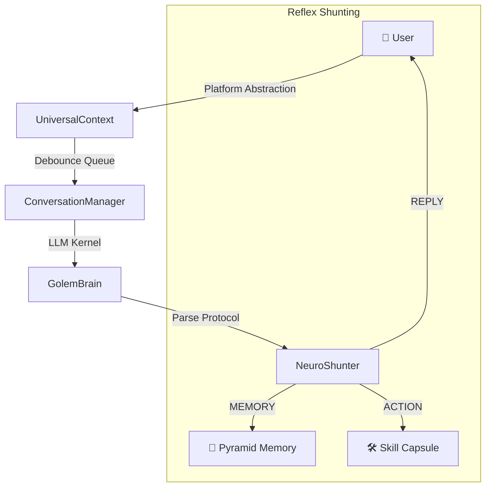

<div align="center">
  
  <h1>🤖 Project Golem v9.1</h1>
  <p><b>Ultimate Chronos + MultiAgent + Social Node Edition</b></p>

  <p>
    
    
    
    
    
  </p>

  <p>
    <a href="#-what-is-this">What is this?</a> •
    <a href="#-core-capabilities">Capabilities</a> •
    <a href="#-use-cases--interface-showcase">Showcase</a> •
    <a href="#-quick-start">Quick Start</a> •
    <a href="#-system-architecture">Architecture</a>
  </p>

  [繁體中文](../README.md) | **English**
</div>

---

## 📖 Table of Contents
- [✨ What is this?](#-what-is-this)
- [🌟 Core Capabilities](#-core-capabilities)
- [📸 Use Cases & Interface Showcase](#-use-cases--interface-showcase)
- [⚡ Quick Start](#-quick-start)
- [🎮 Command Reference](#-command-reference)
- [🏗️ System Architecture](#-system-architecture)
- [🧠 Pyramidal Long-term Memory](#-pyramidal-long-term-memory)
- [📖 Complete Documentation & Guides](#-complete-documentation--guides)

---

## ✨ What is this?

**Project Golem** is not just another chatbot. It is an autonomous AI agent that uses **Web Gemini's infinite context** as its brain and **Puppeteer** as its hands.

- 🧠 **Remember You** — Pyramidal 5-tier memory compression, theoretically preserving **50 years** of conversational essence.
- 🤖 **Autonomous Action** — While you're away, it proactively browses news, introspects, and sends messages to you.
- 🎭 **Summon AI Team** — A single command generates multiple AI experts for roundtable discussions and consensus summaries.
- 🔧 **Dynamic Expansion** — Supports hot-loading skill modules (Skills), and even allows AI to code and learn new skills in a sandbox.

> **Browser-in-the-Loop Architecture**: Golem doesn't rely on restrictive official APIs. It directly controls a browser to use Web Gemini, enjoying the advantages of an "infinite context window" and intuitive operations.

---

## 🌟 Core Capabilities

<table width="100%">
  <tr>
    <td width="50%" valign="top">
      <h3>🧠 Pyramidal Long-term Memory</h3>
      <p>5-tier compression mechanism ensures memory is never lost. Capable of preserving <b>50 years</b> of conversation essence in just <b>3MB</b>.</p>
    </td>
    <td width="50%" valign="top">
      <h3>🎭 Interactive Multi-Agent</h3>
      <p>Summon a team of experts with one click. Agents debate and collaborate on complex problems to provide high-density consensus summaries.</p>
    </td>
  </tr>
  <tr>
    <td width="50%" valign="top">
      <h3>🤖 Autonomous Observation</h3>
      <p>Golem browses news, introspects, and messages you spontaneously even when you're away. It possesses true "digital free will."</p>
    </td>
    <td width="50%" valign="top">
      <h3>🔧 Dynamic Skill Capsules</h3>
      <p>Hot-reloadable skills that can be packaged. Golem can even learn to code new skills for itself in a sandboxed environment.</p>
    </td>
  </tr>
</table>

---

## 📸 Use Cases & Interface Showcase

To help you better monitor and manage your Golem, we provide a fully functional **Web Dashboard**.

### 🎛️ Tactical Console (Dashboard Home)
*Oversee your high-level AI agent status, active processes, and dynamic behavior decisions.*


### 💻 Web Terminal (Interactions)
*Communicate with Golem with zero latency via web interface, featuring cross-platform syncing and task tracking.*


### 📚 Skill Manager
*Install or toggle specialized AI skills like hot-swappable USB drives with seamless API integration.*


### 👥 Personality Settings
*Configure Golem's basic attributes and behavioral patterns.*


### 🧠 Memory Core
*View and manage Golem's memory core.*


### ⚙️ Settings
*Manage security permissions, API keys, and deep system integrations intuitively.*


---

## ⚡ Quick Start

### Prerequisites
- **Node.js** v20+
- **Google Chrome** (Required for Puppeteer)
- **Telegram Bot Token** (Get from [@BotFather](https://t.me/BotFather))

### ⚡ Recommended: One-click Magic Mode
For first-time users, we provide a fully automated setup script.
Double-click `Start-Golem.command` (Mac/Linux) in the project directory. It will automatically download dependencies and start the Node server and Dashboard.

**🔨 Manual Operation (Terminal)**
```bash
# Grant execution permissions
chmod +x setup.sh

# Fully automated installation
./setup.sh --magic

# Start directly
./setup.sh --start
```

### Windows
> **Tip:** For the best experience, we strongly recommend Windows users use **[Git Bash](https://git-scm.com/downloads)** to run the setup script.

1. Open Git Bash.
2. Navigate to the project directory.
3. Run `./setup.sh --magic` for automated installation and startup.

---

## 🎮 Command Reference

| Command | Function |
|------|------|
| `/help` | View full command descriptions |
| `/new` | Reset conversation and load relevant memory |
| `/learn <feature>` | Have the AI automatically learn and generate a new skill |
| `/skills` | List all installed skills |

---

## 🏗️ System Architecture

Golem utilizes the unique **Browser-in-the-Loop** hybrid architecture, granting it flexibility beyond standard API limitations.



### 🧠 Technical Deep Dive
- **Browser-in-the-Loop**: Unlike traditional API-based bots, Golem uses Puppeteer to simulate human behavior on Web Gemini. This provides access to the **1M+ Token Infinite Context Window** for free.
- **Reflex Shunting**: Golem's brain produces structured `GOLEM_PROTOCOL` instructions instead of raw text. This allows the agent to precisely determine when to talk, when to remember, and when to execute skill scripts.

---

## 🧠 Pyramidal Long-term Memory

This is Golem's most unique technical capability, ensuring memory is never lost through multi-tier compression:

1. **Tier 0**: Hourly raw conversation logs.
2. **Tier 1 (Daily)**: Daily summaries (~1,500 words).
3. **Tier 2 (Monthly)**: Monthly highlights.
4. **Tier 3 (Yearly)**: Yearly reviews.
5. **Tier 4 (Epoch)**: Epoch milestones.

**50-Year Storage Comparison:**
* **Legacy (No Compression)**: ~18,250 files / 500 MB+
* **Golem Pyramid**: **~277 files / 3 MB**

---

## 📖 Complete Documentation & Guides

To keep this page concise, more in-depth technical details have been moved to dedicated documents:

| Document | Description |
|------|------|
| [🔌 MCP Usage & Development Guide](MCP-Guide.en.md) | **[New]** How to install, configure, and call MCP Servers (includes Hacker News example) |
| [🤖 AI Agent Guide](AGENTS.en.md) | **[Important]** Guidelines for AI assistants and developers on code maintenance |
| [🧠 Memory System Architecture](記憶系統架構說明.md) | Pyramid compression principles and storage path analysis |
| [🖥️ Web Dashboard Guide](Web-Dashboard-Guide.en.md) | Extended details for each tab in the Web UI |
| [🛠️ Developer Implementation Guide](開發者實作指南.md) | How to implement new Skills and Golem Protocol specifications |
| [🎮 Command Reference List](golem指令說明一覽表.md) | Quick reference for Telegram / Discord commands |
| [🔑 Getting Robot Tokens](如何獲取TG或DC的Token及開啟權限.md) | How to set up your external communication platforms |

---

## ☕ Support & Community

If Golem has helped you, feel free to give it a star ⭐️, or buy the author a coffee!

<a href="https://www.buymeacoffee.com/arvincreator" target="_blank">
  
</a>

[💬 Join Line Community (ZH)](https://line.me/ti/g2/wqhJdXFKfarYxBTv34waWRpY_EXSfuYTbWc4OA?utm_source=invitation&utm_medium=link_copy&utm_campaign=default)  
[👾 Join Discord Community](https://discord.gg/bC6jtFQra)

---

## 📈 Star History

[](https://star-history.com/#Arvincreator/project-golem&Date)

---

## ⚠️ Disclaimer

1. **Security Risk**: Do not grant root/admin permissions in production environments.
2. **Privacy Note**: the `golem_memory/` folder contains Session Cookies; please keep it secure.
3. Users assume all risks associated with operations; developers assume no legal liability.

---

<div align="center">

**Developed with ❤️ by Arvincreator & @sz9751210**

</div>
